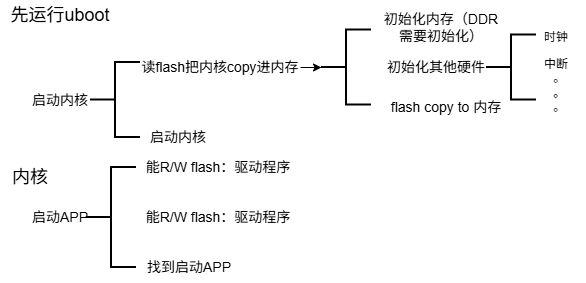

# uboot启动流程

==具体源码自行观看源码，配合着正点原子文档讲解==

## 启动流程简介

uboot为通用bootloader，要支持架构、soc厂家、芯片、板卡厂家、型号
为了让代码精简，引入了设备树，设备树文件编译的时候不会编译进bin文件

u-boot = uboot.bin + .dtb

bootrom存储在芯片rom内，作用是copy bootloader到ram上（非xip启动要多这一步）

## 启动流程概况

- 一上电，CPU必定从XIP设备取得第一条指令
- 号称支持NAND启动，支持SD卡启动，支持USB启动，支持UART启动的芯片，里面必定有BootROM
	- bootrom：硬件初始化、把程序从非XIP设备复制进RAM，从RAM中执行（==这也是bootrom的作用==）

**如何支持多种启动方式**（SD卡、EMMC、USB、UART启动）

- 方法一：芯片有boot pin，决定使用哪个外设，bootrom根据引脚决定读取哪个设备程序
- 方法二：芯片有boot pin，决定多种外设的尝试顺序
	- 示例顺序1：EMMC、USB、SD
	-  示例顺序1：EMMC、SD、USB

**完整的u-boot如何复制进内存**

BootROM被用来启动用户程序，用户程序可能有几百KB、几MB，但是片内的RAM只有几KB：

- 方法1：（我接触的是这个方法）
    - BootROM从启动设备读取用户程序的前几KB到SRAM，运行它；
    - 这前几KB的代码负责：初始化DDR、把完整的程序从启动设备复制到DDR、并跳到DDR运行
- 方法2：
    - BootROM从启动设备读取SPL到SRAM，运行它；
    - SPL负责：初始化DDR、把用户程序从启动设备复制到DDR、并跳到DDR运行

示意图：

**重定位的2种方法**

相对寻址、绝对寻址

重定位有2种方法：
- 程序当前位于地址A，但是它的链接地址是B，把它从A复制到B
- 程序当前位于地址A，想把它复制到B
    - 把它从A复制到B
    - 修改程序，把里面使用到的地址都重新为基于B的新地址

**U-Boot的两个阶段**

u-boot的源码大致可以分为2个阶段：

- board_init_f：f的意思是"running from read-only flash"
    - 作用：初始化硬件（比如DDR、UART），为各个功能预留内存（比如U-boot、Framebuffer、设备树）
- board_init_r：r的意思是"relocated"，意思是重定位过了
    - 作用：初始化各个子系统（各个存储设备、环境变量、网络），进入main_loop

board_init_fh和board_init_r的分析详看韦东山文档：06_u-boot代码分析.md

启动流程1：

启动流程2：

第二步应该还是要复制到SRAM里执行，这里画错了

## UBOOT启动流程

关于具体设备比如imx6u的启动：

启动有两种方式，一种是改写 eFUSE(熔 丝)，一种是修改相应的 GPIO 高低电平。第一种修改 eFUSE 的方式只能修改一次，后面就不能 再修改了，所以我们不使用。我们使用的是通过拨码开关修改 BOOT_MODE\[1:0]对应的 GPIO 高低电平来选择启动方式，所有的开发板都使用的这种方式，I.MX6U 有一个 BOOT_MODE1 引脚和 BOOT_MODE0 引脚，这两个引脚对应这BOOT_MODE\[1:0]。

**内部 BOOT 模式（芯片内部的bootRom将引导程序拷贝到指定的内存地址）**

当 BOOT_MODE1 为 1，BOOT_MODE0 为 0 的时候此模式使能，在此模式下，芯片会执行内部的 boot ROM 代码，这段 boot ROM 代码会进行硬件初始化(一部分外设)，然后从 boot 设备(就是存放代码的设备、比如 SD/EMMC、NAND)中将引导代码拷贝出来复制到指定的 RAM 中， 一般是 DDR。

### Boot ROM 与 U-Boot 启动流程的关系

在典型的嵌入式系统中，Boot ROM 和 U-Boot 的启动流程大致如下：

- CPU复位与Boot ROM执行
	- 当系统加电或复位时，CPU从复位向量地址开始执行代码，这个地址指向Boot ROM中的代码。
	- Boot ROM执行初步的硬件初始化，如基本的系统时钟主频、片上RAM的配置等。
	- Boot ROM检测启动模式（例如通过引脚状态或配置寄存器），决定从哪个设备加载二级引导程序。

- 加载二级引导程序（U-Boot）
	- 根据启动模式，Boot ROM从选定的存储介质（如Flash存储器）中读取二级引导程序（通常是U-Boot）到片上RAM或外部RAM。
	- 加载完成后，Boot ROM将程序计数器（PC）设置为U-Boot的入口地址，将控制权移交给U-Boot。

**U-Boot 启动流程概述**

U-Boot的启动流程可以分为以下几个阶段：

1. CPU上电复位（Initial CPU Reset）也就是bootROM的执行
2. 启动汇编代码（Start-up Assembly Code）
3. 板级初始化（Board Initialization）
4. 初始化内存控制器（Memory Controller Initialization）
5. C语言环境初始化（Initialization of C Runtime Environment）
加载并启动内核或其他镜像（Load and Boot the OS Kernel or Other Image）

**详细启动步骤**

1. CPU上电复位
- 上电复位：系统上电或复位时，CPU首先执行从一个预定义的复位向量开始的指令。这些指令通常存储在只读存储器（ROM）或闪存的固定位置。（BootROM）
- 执行初始化代码：在复位后，CPU会执行初始化代码，该代码通常用汇编语言编写。这些初始指令一般会关闭Cache和MMU，以保证系统以一种可预测的方式启动。

2. 启动汇编代码
- 堆栈指针初始化：初始化堆栈指针，通常使用内嵌的SRAM来设置堆栈位置，因为此时外部RAM可能还未初始化。
- CPU模式设置：在ARM架构的系统中，通常会将CPU切换到管理模式（Supervisor mode）或中断模式（IRQ mode）下，以便有足够的权限进行接下来的初始化操作。
- 关闭Cache和MMU：通常在初始化过程中，Cache和MMU都是关闭的。这是为了避免Cache中存在的任何旧数据影响系统初始化的正确性，并确保物理地址空间能够被正确访问。

3. 板级初始化（Board Initialization）
- 初始化引脚和外设：启动汇编代码会执行一些板级初始化操作，包括设置GPIO、初始化串口等。这些操作通常是特定于硬件平台的。
- 内存控制器初始化：在初始化外部RAM之前，必须先初始化内存控制器。这包括设置内存控制寄存器，配置内存的时序参数等。

4. 内存初始化
- 初始化外部RAM：在内存控制器初始化后，外部RAM就可以被使用。此时，可以将堆栈指针从内嵌SRAM迁移到外部RAM，以提供更多的堆栈空间。
- 拷贝U-Boot到RAM：通常，U-Boot在启动时是从Flash存储器中运行的，为了加快执行速度，通常会将U-Boot代码从Flash拷贝到RAM中执行。uboot 会将自己重定位到 DRAM 最后面的地址区域，也就是将自己拷贝到 DRAM 最后面的内存区域中。

5. C语言环境初始化
- 初始化全局数据区：此时可以进行全局变量的初始化，并设置全局数据区。
- 调用C函数：随着C环境的初始化，U-Boot从汇编代码过渡到C代码，接下来大部分初始化和功能都在C代码中实现。

6. Cache和MMU配置
- MMU（内存管理单元）配置：在某些系统中，U-Boot会在C环境初始化后配置MMU，以启用虚拟内存管理。启用MMU后，系统可以使用虚拟地址空间，这对于复杂的操作系统启动过程是必要的。
- Cache初始化：Cache的使用可以显著提升系统性能。U-Boot在这个阶段会根据需要启用Cache。

7. 加载并启动内核或其他镜像
- 加载镜像：U-Boot的主要功能之一是加载并启动操作系统内核或其他镜像（如Linux、RTOS等）。从flash中读取环境变量到内存，选择从某一介质（如Flash、SD卡、网络等）加载镜像。
- 启动操作系统：在加载内核镜像后，U-Boot会跳转到内核的入口点，并将控制权交给内核，完成系统引导。

总结：初始化 >重定位 > 加载内核 >设置内核启动参数 > 启动内核