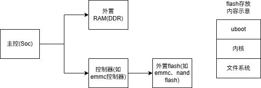

# uboot配置过程

## 杂记

==如果不是专门搞这个，会使用、配置、裁剪、移植就行==
ddr为内存，emmc、nand flash为外存
## u-boot功能

就是启动内核：
- 读Flash，把内核读入内存
- 启动内核

u-boot核心：命令

## Linux开发板结构


mcu开发板使用的ram和flash一般内置在芯片里
Linux开发板使用的ram(DDR)和flash一般外置在开发板上
## uboot目录结构

### arch/arm目录结构

arch目录下存放的是各个架构文件，这里以arm架构举例

| 目录         | 说明                                                             |
| ---------- | -------------------------------------------------------------- |
| `cpu/`     | 按 ARM 架构版本（ARMv7、ARMv8、ARM926EJS 等）组织的 CPU 启动代码和初始化代码          |
| `lib/`     | ARM 架构相关的通用库函数（如 `vectors.S`、重定位代码等）                           |
| `include/` | ARM 架构专用的头文件（如 `asm/arch-socfpga/` 等）                          |
| `dts/`     | 设备树源文件（.dts 和 .dtsi），用于描述硬件平台                                  |
| `mach-*/`  | SoC 厂商特定的机器层代码（如 `mach-socfpga/`、`mach-omap2/`、`mach-at91/` 等） |

```plain
arch/arm/
├── cpu/
│   ├── armv7/           # ARMv7 架构 (Cortex-A 系列)
│   │   ├── start.S      # 启动入口代码
│   │   ├── lowlevel_init.S
│   │   └── u-boot.lds   # 链接脚本
│   ├── armv8/           # ARMv8 (64位 ARM)
│   │   ├── start.S
│   │   └── u-boot.lds
│   ├── arm926ejs/       # ARM926EJS (如 AT91SAM9)
│   ├── arm1136/         # ARM1136
│   └── u-boot-spl.lds   # SPL 链接脚本
│
├── lib/
│   ├── vectors.S        # 异常向量表
│   ├── relocate.S       # 代码重定位
│   ├── crt0.S / crt0_64.S  # C 运行时初始化
│   └── bootm.c          # bootm 命令实现
│
├── include/
│   └── asm/
│       ├── arch-*/        # 各 SoC 架构专用头文件
│       │   └── ...
│       └── ...
│
├── dts/
│   ├── Makefile          # 设备树编译规则
│   ├── *.dts             # 板级设备树源文件
│   └── *.dtsi            # 设备树包含文件
│
└── mach-*/               # 机器层 (Machine Layer)
    ├── mach-socfpga/     # Altera/Intel SoC FPGA
    ├── mach-omap2/       # TI OMAP
    ├── mach-at91/        # Microchip AT91
    └── ...
```


| 文件夹     | 说明                                   |
| ------- | ------------------------------------ |
| board   | 存放各个公司的各个开发板，==结构为：board/公司/芯片/开发板== |
| cmd     | 命令相关代码。为通用文件                         |
| common  | 共用文件                                 |
| configs | 配置文件，==存放板子的默认配置文件(defconfig)==      |
| driver  | 驱动                                   |
| dtb     | 设备树                                  |
| fs      | 文件系统                                 |
| include | 头文件                                  |
| lib     | 库文件                                  |
| net     | 网络文件                                 |

### make的技巧

打印Makefile的规则和变量：`make -p`

可以把make命令规则和变量存入文件：`make -p > 1.txt`

然后执行`vi 1.txt`，使用vi命令删除注释：`:g/^#/d`

### 默认配置的过程

IMX6ULL: `make mx6ull_14x14_evk_defconfig`

STM32MP157: `make stm32mp15_trusted_defconfig`

执行过程：

- 制作工具：scripts/kconfig/conf
- ==把默认配置信息写入文件".config"==


==所谓配置文件就是赋值和启动一些makefile的变量，没有用到的都注释掉==

makefile中的分析过程：

```shell
mx6ull_14x14_evk_defconfig: scripts/kconfig/conf
    $(Q)$< $(silent) --defconfig=arch/$(SRCARCH)/configs/$@ $(Kconfig)
```

就是：

```shell
UBOOTVERSION=2017.03 scripts/kconfig/conf --defconfig=arch/../configs/mx6ull_14x14_evk_defconfig Kconfig
```

**细节**

1. **`defconfig` 与 `.config` 的区别**：
    
    - `defconfig` 是**最小配置集**，只包含与默认值不同的选项
        
    - `.config` 是**完整配置集**，包含所有选项（包括默认值）
        
2. **后续编译依赖**：Makefile 会读取 `.config` 来决定：
    
    - 编译哪些源文件（通过 `obj-y` 等变量）
        
    - 传递哪些宏定义给编译器
        
    - 链接哪些库

`.config` 是纯文本配置文件，格式如下：

```plain
CONFIG_ARM=y
CONFIG_ARCH_MX6=y
CONFIG_SYS_TEXT_ADDR=0x87800000
CONFIG_BOOTDELAY=3
# CONFIG_USB is not set
```

**配置过程总结**

顶层Makefile会包含2个配置文件：include/config/auto.conf、include/autoconf.mk。

==defconfig + Kconfig -> .config -> conf.h -> u-boot.cfg==

u-boot中有非常多的配置文件：

- ==.config：来自单板的默认配置（defconfig）、Kconfig==
- include/config/auto.conf：来自.config，去掉了很多注释
- include/conf.h：来自.config
- u-boot.cfg：它的内容跟头文件类似，来自conf.h

### Kconfig介绍

对于各类内核，只要支持menuconfig配置界面，都是使用Kconfig。 在配置界面中，可以选择、设置选项，==这些设置会保存在.config文件里==。 编译脚本会包含.config，根据里面的值决定编译哪些文件、怎么编译文件。 .config文件也会被转换为头文件，C程序可以从头文件中获得配置信息。

即，运行完下面命令后：
```shell
make ARCH=arm CROSS_COMPILE=arm-linux-gnueabihf- mx6ull_alientek_emmc_defconfig
make ARCH=arm CROSS_COMPILE=arm-linux-gnueabihf- menuconfig
```
在图形配置界面配置完后保存，保存的信息会同步到.config文件

**`make menuconfig` 读取的是 Kconfig 文件**

具体流程

```plain
make menuconfig
      ↓
调用 scripts/kconfig/mconf 工具
      ↓
读取 Kconfig（根目录的顶层配置文件）
      ↓
递归解析 source 包含的所有子 Kconfig 文件
      ↓
构建配置选项的树形结构
      ↓
显示文本图形界面（TUI）供用户交互
      ↓
保存用户选择到 .config 文件
```

#### 基础语法

上面是一个精简的例子，完整的例子可以从Linux中获得，如下：

```shell
config SGI_SNSC
        bool "SGI Altix system controller communication support"
        depends on (IA64_SGI_SN2 || IA64_GENERIC)
        default y
        help
          If you have an SGI Altix and you want to enable system
          controller communication from user space (you want this!),
          say Y.  Otherwise, say N.
```

解释如下：

- config 表示`config option`，这是Kconfig的基本entry；其他entry是用来管理config的。 config 表示一个配置选项的开始，紧跟着的 SGI_SNSC 是配置选项的名称。 config 下面几行定义了该配置选项的属性。 属性可以是该配置选项的：类型、输入提示、依赖关系、默认值、帮助信息。
    - bool 表示配置选项的类型，每个 config 菜单项都要有类型定义，变量有5种类型
        - bool 布尔类型
        - tristate 三态类型
        - string 字符串
        - hex 十六进制
        - int 整型
    - "SGI Altix system controller communication support"：提示信息
    - depends on：表示依赖关系，只有(IA64_SGI_SN2 || IA64_GENERIC)被选中，才可以选择SGI_SNSC
    - select XXX：表示反向依赖关系，即当前配置选项被选中后，`XXX`选项就会被选中。
    - default 表示配置选项的默认值，bool 类型的默认值可以是 y/n。
    - help 帮助信息，在`menuconfig`界面输入H键时，就会提示帮助信息。

#### 实现菜单menu/endmenu

示例代码：`rt-smart/kernel/src/Kconfig`，代码如下：

```shell
menu "Boot media"

config NOR_BOOT
        bool "Support for booting from NOR flash"
        depends on NOR
        help
          Enabling this will make a U-Boot binary that is capable of being
          booted via NOR.  In this case we will enable certain pinmux early
          as the ROM only partially sets up pinmux.  We also default to using
          NOR for environment.

config NAND_BOOT
        bool "Support for booting from NAND flash"
        default n
        help
          Enabling this will make a U-Boot binary that is capable of being
          booted via NAND flash. This is not a must, some SoCs need this,
          some not.

config ONENAND_BOOT
        bool "Support for booting from ONENAND"
        default n
        help
          Enabling this will make a U-Boot binary that is capable of being
          booted via ONENAND. This is not a must, some SoCs need this,
          some not.

config QSPI_BOOT
        bool "Support for booting from QSPI flash"
        default n
        help
          Enabling this will make a U-Boot binary that is capable of being
          booted via QSPI flash. This is not a must, some SoCs need this,
          some not.

config SATA_BOOT
        bool "Support for booting from SATA"
        default n
        help
          Enabling this will make a U-Boot binary that is capable of being
          booted via SATA. This is not a must, some SoCs need this,
          some not.

config SD_BOOT
        bool "Support for booting from SD/EMMC"
        default n
        help
          Enabling this will make a U-Boot binary that is capable of being
          booted via SD/EMMC. This is not a must, some SoCs need this,
          some not.

config SPI_BOOT
        bool "Support for booting from SPI flash"
        default n
        help
          Enabling this will make a U-Boot binary that is capable of being
          booted via SPI flash. This is not a must, some SoCs need this,
          some not.

endmenu
```

界面如下：


**语法**

解释如下：

- menu "xxx"表示一个菜单，菜单名是"xxx"
    
- menu和endmenu之间的entry都是"xxx"菜单的选项
    
- 在上面的例子中子菜单有6个选项：

#### 实现单选choice/endchoice

示例代码：`rt-smart/kernel/src/Kconfig`，代码如下：

```shell
config DEBUG_UART
        bool "Enable an early debug UART for debugging"
        help
          The debug UART is intended for use very early in U-Boot to debug
          problems when an ICE or other debug mechanism is not available.

choice
        prompt "Select which UART will provide the debug UART"
        depends on DEBUG_UART
        default DEBUG_UART_NS16550

config DEBUG_UART_ALTERA_JTAGUART
        bool "Altera JTAG UART"
        help
          Select this to enable a debug UART using the altera_jtag_uart driver.
          You will need to provide parameters to make this work. The driver will
          be available until the real driver model serial is running.

config DEBUG_UART_ALTERA_UART
        bool "Altera UART"
        help
          Select this to enable a debug UART using the altera_uart driver.
          You will need to provide parameters to make this work. The driver will
          be available until the real driver model serial is running.

endchoice
```

界面如下：


**语法**

解释如下：

- choice表示"选择"
- choice和endchoice之间的entry是可以选择的项目
    - 它们之间，只能有一个被设置为"y"：表示编进内核
    - 它们之间，可以设置多个为"m"：表示编译为模块
    - 比如一个硬件有多个驱动程序
        - 同一时间只能有一个驱动能编进内核
        - 但是多个驱动都可以单独编译为模块

#### source

source 语句用于读取另一个文件中的 Kconfig 文件， 比如`Kconfig`中就包含了其他Kconfig：

```shell
source "arch/Kconfig"
```

#### comment

comment 语句出现在界面的第一行，用于定义一些提示信息，如`cmd/Kconfig`：

```shell
comment "Commands"
```

剩下的语法看韦东山的文档Kconfig介绍.md


## 编译过程

**编译uboot**

```c
make ARCH=arm CROSS_COMPILE=arm-linux-gnueabihf- distclean
make ARCH=arm CROSS_COMPILE=arm-linux-gnueabihf- mx6ull_14x14_ddr512_emmc_defconfig
make V=1 ARCH=arm CROSS_COMPILE=arm-linux-gnueabihf- -j12
```

**make过程**

- 检查、更新头文件，比如include/config.h 、u-boot.cfg
- 制作工具
- 交叉编译
    - 编译哪些目录、哪些文件？
    - .c文件可能需要使用.config的配置值，它可以引用config.h

==如何使用.config决定编译哪些目录==

==用obj-y变量存储要编译的文件，每个目录下都有makefile文件选择当前文件夹下那些文件要编译，如果加入的是xxx/，表示是目录，要继续递归执行makefile，和cmake类似，每个文件夹下都存放在管理当前文件夹的文件==

上课时临时精简出来的Makefile：

```shell
ifeq ($(KBUILD_SRC),)


# That's our default target when none is given on the command line
PHONY := _all
_all:

endif # ifeq ($(KBUILD_SRC),)

# We process the rest of the Makefile if this is the final invocation of make
ifeq ($(skip-makefile),)

PHONY += all
_all: all

HOSTCC       = cc

# Decide whether to build built-in, modular, or both.
# Normally, just do built-in.

KBUILD_MODULES :=
KBUILD_BUILTIN := 1

# 引入很多变量, 
# 比如:
# build := -f $(srctree)/scripts/Makefile.build obj
include scripts/Kbuild.include

# 定义交叉编译工具链
AS        = $(CROSS_COMPILE)as
CC        = $(CROSS_COMPILE)gcc
CPP        = $(CC) -E


version_h := include/generated/version_autogenerated.h
timestamp_h := include/generated/timestamp_autogenerated.h

no-dot-config-targets := clean clobber mrproper distclean \
             help %docs check% coccicheck \
             ubootversion backup tests

config-targets := 0
mixed-targets  := 0
dot-config     := 1


ifeq ($(mixed-targets),1)
else
ifeq ($(config-targets),1)
else
PHONY += scripts
scripts: scripts_basic include/config/auto.conf
    $(Q)$(MAKE) $(build)=$(@)

ifeq ($(dot-config),1)
-include include/config/auto.conf
-include include/config/auto.conf.cmd
# To avoid any implicit rule to kick in, define an empty command
$(KCONFIG_CONFIG) include/config/auto.conf.cmd: ;

# If .config is newer than include/config/auto.conf, someone tinkered
# with it and forgot to run make oldconfig.
# if auto.conf.cmd is missing then we are probably in a cleaned tree so
# we execute the config step to be sure to catch updated Kconfig files
include/config/%.conf: $(KCONFIG_CONFIG) include/config/auto.conf.cmd
    $(Q)$(MAKE) -f $(srctree)/Makefile silentoldconfig #生成auto.conf
    @# If the following part fails, include/config/auto.conf should be
    @# deleted so "make silentoldconfig" will be re-run on the next build.
    $(Q)$(MAKE) -f $(srctree)/scripts/Makefile.autoconf || \
        { rm -f include/config/auto.conf; false; } #生成include/config.h u-boot.cfg include/autoconfig.mk
    @# include/config.h has been updated after "make silentoldconfig".
    @# We need to touch include/config/auto.conf so it gets newer
    @# than include/config.h.
    @# Otherwise, 'make silentoldconfig' would be invoked twice.
    $(Q)touch include/config/auto.conf

-include include/autoconf.mk
-include include/autoconf.mk.dep
```

### 配置文件进一步处理

前面生成了.config，但是它==不是最终版本的配置文件，u-boot.cfg才是==。

顶层Makefile会 include 2个配置文件：include/config/auto.conf、include/autoconf.mk。

u-boot中有非常多的配置文件：

- .config：来自单板的默认配置、Kconfig
    
- include/config/auto.conf：来自.config，去掉了很多注释，配置信息和.config一样，只是去掉了注释
    
- u-boot.cfg：它的内容跟头文件类似，来自
    
    - .config
        
    - 头文件include/common.h，又包含了"#include <config.h>"，
- include/autoconf.mk：来自u-boot.cfg，但是移除include/config/auto.conf的内容以免重复

config.h内容如下:
```c
/* Automatically generated - do not edit */ #define CONFIG_IMX_CONFIG board/freescale/mx6ullevk/imximage.cfg #define CONFIG_BOARDDIR board/freescale/mx6ullevk #include <config_defaults.h> #include <config_uncmd_spl.h> #include <configs/mx6ullevk.h> #include <asm/config.h> #include <linux/kconfig.h> #include <config_fallbacks.h>
```

具体详看韦东山的文档：05_编译uboot的过程分析.md


