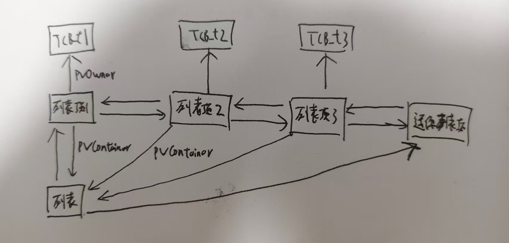
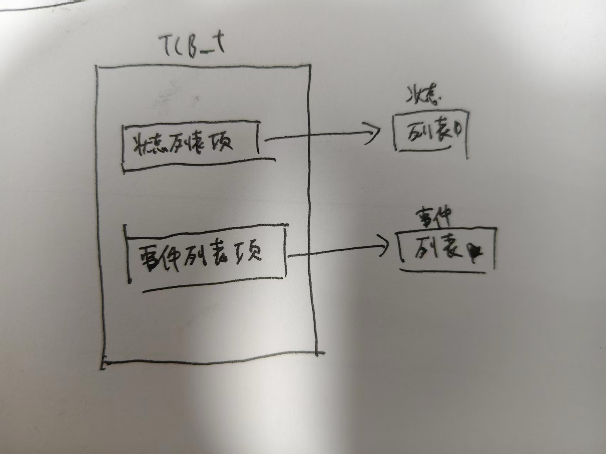

# Freertos任务调度

## 任务相关API函数

|         | API                     | 说明                             |
| ------- | ----------------------- | ------------------------------ |
| 任务创建和删除 | xTaskCreate()           | 使用动态的方法创建一个任务。                 |
|         | xTaskCreateStatic()     | 使用静态的方法创建一个任务。                 |
|         | xTaskCreateRestricted() | 创建一个使用MPU进行限制的任务，相关内存使用动态内存分配。 |
|         | vTaskDelete()           | 删除一个任务。                        |
| 任务挂起和恢复 | vTaskSuspend()          | 挂起一个任务。                        |
|         | vTaskResume()           | 恢复一个任务的运行。                     |
|         | xTaskResumeFromISR()    | 中断服务函数中恢复一个任务的运行               |
### xTaskCreate()

任务创建

```c
BaseType_t xTaskCreate( TaskFunction_t pxTaskCode,
						const char * const pcName,
						const configSTACK_DEPTH_TYPE usStackDepth,
						void * const pvParameters,
						UBaseType_t uxPriority,
						TaskHandle_t * const pxCreatedTask )
```

**参数**：

| 参数            | 说明                                                                                          |
| ------------- | ------------------------------------------------------------------------------------------- |
| pxTaskCode    | 任务函数                                                                                        |
| pcName        | 任务名字，一般用于追踪和调试，任务名字长度不能超过。configMAX_TASK_NAME_LEN。                                          |
| usStackDepth  | 任务堆栈大小，注意实际申请到的堆栈是usStackDepth的4倍。其中空闲任<br>务的任务堆栈大小为configMINIMAL_STACK_SIZE。               |
| pvParameters  | 传递给任务函数的参数。                                                                                 |
| uxPriotiry    | 任务优先级，范围0~ configMAX_PRIORITIES-1。                                                          |
| pxCreatedTask | 任务句柄，任务创建成功以后会返回此任务的任务句柄，这个句柄其实就是<br>任务的任务堆栈。此参数就用来保存这个任务句柄。其他API函数可能会使用到这个句柄。==即TCB_t的指针== |

**返回值**：
- pdPASS:任务创建成功。errCOULD_NOT_ALLOCATE_REQUIRED_MEMORY： 任务创建失败，因为堆内存不足！
## 列表和列表项

### 数据结构

#### TCB_t

任务控制块

```c
typedef struct tskTaskControlBlock
{
    volatile StackType_t pxTopOfStack;  //任务堆栈栈顶

	#if ( portUSING_MPU_WRAPPERS == 1 )
		xMPU_SETTINGS xMPUSettings;  //MPU 相关设置
	#endif
	
	ListItem_t xStateListItem;  //状态列表项
	ListItem_t xEventListItem;  //事件列表项
	UBaseType_t uxPriority;  //任务优先级
	StackType_t *pxStack;  //任务堆栈起始地址
	char pcTaskName[ configMAX_TASK_NAME_LEN ];  //任务名字
	
	#if ( portSTACK_GROWTH > 0 )
		StackType_t*pxEndOfStack;  //任务堆栈栈底
	#endif
	
	#if ( portCRITICAL_NESTING_IN_TCB == 1 )
		UBaseType_t uxCriticalNesting;  //临界区嵌套深度
	#endif

	#if ( configUSE_MUTEXES == 1 )
		UBaseType_t uxBasePriority;  //任务基础优先级,优先级反转的时候用到
		UBaseType_t uxMutexesHeld;  //任务获取到的互斥信号量个数
	#endif
	
	#if( configGENERATE_RUN_TIME_STATS == 1 )
		uint32_t ulRunTimeCounter;  //用来记录任务运行总时间
	#endif
	
	#if( configUSE_TASK_NOTIFICATIONS == 1 ) //任务通知相关变量
		volatile uint32_t ulNotifiedValue; //任务通知值
		volatile uint8_t ucNotifyState;  //任务通知状态
	#endif

	#if( tskSTATIC_AND_DYNAMIC_ALLOCATION_POSSIBLE != 0 )
		//用来标记任务是动态创建的还是静态创建的， 如果是静态创建的此变量就为 pdTURE，
		//如果是动态创建的就为 pdFALSE
		uint8_t ucStaticallyAllocated;
	#endif
} tskTCB;
```

---
#### List_t

列表

```c
typedef struct xLIST
{
    listFIRST_LIST_INTEGRITY_CHECK_VALUE  //检查列表完整性
    
    volatile UBaseType_t uxNumberOfItems;  //记录列表中列表项的数量
    ListItem_t * configLIST_VOLATILE pxIndex;  //用来记录当前列表项索引号，用于遍历列表
    MiniListItem_t xListEnd;  //列表中最后一个列表项，用来表示列表结束，此变量类型为 MiniListItem_t,这是一个迷你列表项                
      
    listSECOND_LIST_INTEGRITY_CHECK_VALUE  //检查列表完整性  
} List_t;
```

---
#### List_t

==列表项==

```c
struct xLIST_ITEM
{
    listFIRST_LIST_ITEM_INTEGRITY_CHECK_VALUE  

    configLIST_VOLATILE TickType_t xItemValue;  //列表项值，为uint32_t类型
    struct xLIST_ITEM * configLIST_VOLATILE pxNext;  //指向下一个列表项
    struct xLIST_ITEM * configLIST_VOLATILE pxPrevious;  //指向前一个列表项，和 pxNext 配合起来实现类似双向链表的功能
    void * pvOwner;  //记录此链表项归谁拥有，通常是任务控制块(TCB_t)，指向TCB_t
    struct xLIST * configLIST_VOLATILE pxContainer;  //用来记录此列表项归哪个列表

    listSECOND_LIST_ITEM_INTEGRITY_CHECK_VALUE
};
typedef struct xLIST_ITEM ListItem_t;
```

注意和 pvOwner 的区别，在前面讲解任务控制块 TCB_t 的时候说了在 TCB_t 中有两个变量 xStateListItem 和 xEventListItem， 这两个变量的类型就是 ListItem_t，也就是说这两个成员变量都是列表项。以 xStateListItem 为例，当创建一个任务以后 xStateListItem 的 pvOwner 变量就指向这个任务的任务控制块， 表示 xSateListItem属于此任务。当任务就绪态以后 xStateListItem 的变量 pvContainer 就指向就绪列表，表明此列表项在就绪列表中。

**关系示意图**




**也就是说TCB_t靠xStateListItem 和 xEventListItem指向各个列表**

---
#### MiniListItem_t

==迷你列表项==

```c
struct xMINI_LIST_ITEM
{
	listFIRST_LIST_ITEM_INTEGRITY_CHECK_VALUE
	
	configLIST_VOLATILE TickType_t xItemValue;  //列表项值，为uint32_t类型
	struct xLIST_ITEM * configLIST_VOLATILE pxNext;  //指向下一个列表项
	struct xLIST_ITEM * configLIST_VOLATILE pxPrevious;  //指向前一个列表项，和 pxNext 配合起来实现类似双向链表的功能
};
typedef struct xMINI_LIST_ITEM MiniListItem_t;
```

### API接口

|     | API                                                                               | 说明               |
| --- | --------------------------------------------------------------------------------- | ---------------- |
| 初始化 | void vListInitialise( List_t * const pxList )                                     | 列表初始化            |
|     | void vListInitialiseItem( ListItem_t * const pxItem )                             | 列表项初始化           |
| 插入  | void vListInsert( List_t * const pxList,<br>ListItem_t * const pxNewListItem )    | 列表项插入            |
|     | void vListInsertEnd( List_t * const pxList,<br>ListItem_t * const pxNewListItem ) | 列表项末尾插入          |
| 删除  | UBaseType_t uxListRemove( ListItem_t * const pxItemToRemove )                     | 列表项的删除           |
| 遍历  | \#define listGET_OWNER_OF_NEXT_ENTRY( pxTCB, pxList )                             | 列表的遍历            |

**注意**：列表项的删除只是将指定的列表项从列表中删除掉，并不会将这个列表项的内存给
释放掉！如果这个列表项是动态分配内存的话。

上面的遍历不是自己理解的遍历，。每调用一次这个函数列表的 pxIndex 变量就会指向下一个列表项，并且返回这个列表项的 pxOwner，即这个列表项所属TCB。

## 调度器

### 开启调度

```c
void vTaskStartScheduler( void )
```

==用户级开启调度==

**说明**：
1. 创建空闲任务
2. 如果使用软件定时器的话还需要通过函数 xTimerCreateTimerTask()来创建定时器服务任务
3. 关闭中断，在 SVC 中断服务函数 vPortSVCHandler()中会打开中断
4. 变量 xSchedulerRunning 设置为 pdTRUE，表示调度器开始运行
5. 调用函数 **xPortStartScheduler()** 来初始化跟调度器启动有关的硬件，比如滴答定时器、FPU 单元和 PendSV 中断等等。

```c
BaseType_t xPortStartScheduler( void )
```

==硬件级开启调度==

```c
BaseType_t xPortStartScheduler( void )
{
	/******************************************************************/
	/****************此处省略一大堆的条件编译代码**********************/
	/*****************************************************************/
	
	portNVIC_SYSPRI2_REG |= portNVIC_PENDSV_PRI;
	portNVIC_SYSPRI2_REG |= portNVIC_SYSTICK_PRI;
	
	vPortSetupTimerInterrupt();
	uxCriticalNesting = 0;
	prvStartFirstTask();
	
	//代码正常执行的话是不会到这里的！
	return 0;
}
```

**说明**：
1.   设置 PendSV 的中断优先级，为最低优先级。
2. 设置滴答定时器的中断优先级，为最低优先级。
3. 调用函数 vPortSetupTimerInterrupt()来设置滴答定时器的定时周期， 并且使能滴答定时器的中断，函数比较简单，大家自行查阅分析。
4. 初始化临界区嵌套计数器。
5. 调用函数 prvStartFirstTask()开启第一个任务。

```c
__asm void prvStartFirstTask( void )
{
	PRESERVE8
	//重定向向量表，即使用VTOR 寄存器
	ldr r0, =0xE000ED08  ;R0=0XE000ED08
	
	ldr r0, [r0]  ;取 R0 所保存的地址处的值赋给 R0
	ldr r0, [r0]  ;获取 MSP 初始值 因为向量表的第一个地址保存的是MSP的值
	
	msr msp, r0  ;复位 MSP
	
	cpsie I  ;使能中断(清除 PRIMASK)
	cpsie f  ;使能中断(清除 FAULTMASK)
	
	dsb  ;数据同步屏障
	isb  ;指令同步屏障
	
	svc 0  ;触发 SVC 中断(异常) 请求管理调用
	nop
	nop

}
```

==开启第一个任务==

```c
__asm void xPortPendSVHandler( void )
```

==SVC中断服务函数==

在函数 prvStartFirstTask()中通过调用 SVC 指令触发了 SVC 中断，而第一个任务的启动就
是在 SVC 中断服务函数中完成的，SVC 中断服务函数应该为 SVC_Handler()，但是FreeRTOSConfig.h 中通过#define 的方式重新定义为了 xPortPendSVHandler()，如下：

```c
#define xPortPendSVHandler PendSV_Handler
```

```c
__asm void vPortSVCHandler( void )
{
	PRESERVE8
	
	ldr r3, =pxCurrentTCB  ;R3=pxCurrentTCB 的地址
	
	ldr r1, [r3]  ;取 R3 所保存的地址处的值赋给 R1
	ldr r0, [r1]  ;取 R1 所保存的地址处的值赋给 R0
	ldmia r0!, {r4-r11, r14}  ;出栈 ，R4~R11 和 R14
	
	msr psp, r0  ;进程栈指针 PSP 设置为任务的堆栈
	isb  ;指令同步屏障
	
	mov r0, #0  ;R0=0
	msr basepri, r0  ;寄存器 basepri=0，开启中断
	
	orr r14, #0xd
	bx r14
}
```

**说明**：
1. 获取 pxCurrentTCB 指针的存储地址，pxCurrentTCB 是一个指向 TCB_t 的指针，这个指针永远指向正在运行的任务。
2. 取 R3 所保存的地址处的值赋给 R1。
3. 取 R3 所保存的地址处的值赋给 R0，我们知道任务控制块的第一个字段就是任务堆栈的栈顶指针 pxTopOfStack 所指向的位置
4. R4~R11，R14 这些寄存器出栈
5. 设置进程栈指针 PSP

==xPortPendSVHandler的作用为找到进程栈顶恢复现场==

## 任务切换

PendSV和SysTick中断都设置成最低优先级
### PendSV 异常

可以通过将中断控制和壮态寄存器 ICSR 的 bit28，也就是 PendSV 的挂起位置 1 来触发 PendSV 中断。

==不管什么形式的切换最后都是通过触发pensv异常来实现切换的，即==

```c
portNVIC_INT_CTRL_REG = portNVIC_PENDSVSET_BIT;
```

在 FreeRTOS 中，**PendSV（可挂起的系统调用）中断的核心作用是执行上下文切换（Context Switch）**，即保存当前任务的运行状态，恢复下一个要运行任务的运行状态，实现任务调度。

PendSV 中断服务函数本应该为 PendSV_Handler()，但是 FreeRTOS 使用#define 重定义了，如下：
```c
#define xPortPendSVHandler PendSV_Handle
```
#### 查找下一个要运行的任务

在 PendSV 中断服务程序中有调用函数 vTaskSwitchContext()来获取下一个要运行的任务，也就是查找已经就绪了的优先级最高的任务，缩减后(去掉条件编译)函数源码如下：

```c
void vTaskSwitchContext( void )
{
	if( uxSchedulerSuspended != ( UBaseType_t ) pdFALSE )
	{
		xYieldPending = pdTRUE;
	}
	
	else
	{
		xYieldPending = pdFALSE;
		traceTASK_SWITCHED_OUT();
		taskCHECK_FOR_STACK_OVERFLOW();
		taskSELECT_HIGHEST_PRIORITY_TASK();
		traceTASK_SWITCHED_IN();
	}
}
```

**说明**：
  
- 如果调度器挂起那就不能进行任务切换。
- 调用函数 taskSELECT_HIGHEST_PRIORITY_TASK()获取下一个要运行的任务。
taskSELECT_HIGHEST_PRIORITY_TASK()本质上是一个宏，在 tasks.c 中有定义。

FreeRTOS 中查找下一个要运行的任务有两种方法： 一个是通用的方法， 另外一个就是使用
硬件的方法，这个在我们讲解 FreeRTOSCofnig.h 文件的时候就提到过了，至于选择哪种方法通
过宏 configUSE_PORT_OPTIMISED_TASK_SELECTION 来决定的。当这个宏为 1 的时候就使
用硬件的方法，否则的话就是使用通用的方法，我们来看一下这两个方法的区别。

1、**通用方法**

顾名思义，就是所有的处理器都可以用的方法

pxReadyTasksLists\[]为就绪任务列表数组，一个优先级一个列表，同优先级的就绪任务都挂到相对应的列表中。uxTopReadyPriority 代表处于就绪态的最高优先级值，每次创建任务的时候都会判断新任务的优先级是否大于 uxTopReadyPriority，如果大于的话就将这个新任务的优先级赋值给变量 uxTopReadyPriority

2、**硬件方法**

硬件方法就是使用处理器自带的硬件指令来实现的， 比如 Cortex-M 处理器就带有的计算前
导 0 个数指令：CLZ

==具体代码需要时再研究==

### SysTick中断

```plain
┌─────────────────────────────────────┐
│         SysTick 中断 (每 1ms)        │
│    （频率由 configTICK_RATE_HZ 定）  │
└─────────────────────────────────────┘
                   │
                   ▼
┌─────────────────────────────────────┐
│  1. 更新全局 Tick 计数器             │
│     xTickCount++                    │
│     （记录系统运行时间）              │
└─────────────────────────────────────┘
                   │
                   ▼
┌─────────────────────────────────────┐
│  2. 检查延时列表（Delayed Task List） │
│     ├── 遍历等待中的任务              │
│     └── 将到期任务移入就绪列表        │
│        （vTaskDelay() 到期的任务）    │
└─────────────────────────────────────┘
                   │
                   ▼
┌─────────────────────────────────────┐
│  3. 触发 PendSV（如需切换）            │
│     └── 挂起 PendSV，延迟执行上下文切换 │
└─────────────────────────────────────┘
```

### FreeRTOS 任务切换场合

- 执行一个系统调用
- 系统滴答定时器(SysTick)中断


## FreeRTOS 系统内核控制函数

| 函数                            | 描述                                                                         |
| ----------------------------- | -------------------------------------------------------------------------- |
| taskYIELD()                   | 任务切换，在cortex-m3中本质还是触发pendsv异常                                             |
| taskENTER_CRITICAL()          | 进入临界区，用于任务中，在cortex-m3实现方式是用硬件屏蔽指定阈值的中断请求                                  |
| taskEXIT_CRITICAL()           | 退出临界区，用于任务中                                                                |
| taskENTER_CRITICAL_FROM_ISR() | 进入临界区，用于中断服务函数中，和普通的临界区的区别为，保存原本的中断阈值，写入一个新的中断阈值（新的中断阈值也是自己一开始设置的），返回原本的阈值 |
| taskEXIT_CRITICAL_FROM_ISR()  | 退出临界区，将原本的阈值重新写回中断阈值寄存器                                                    |
| taskDISABLE_INTERRUPTS()      | 关闭中断                                                                       |
| taskENABLE_INTERRUPTS()       | 打开中断                                                                       |
| vTaskStartScheduler()         | 开启任务调度器                                                                    |
| vTaskEndScheduler()           | 关闭任务调度器                                                                    |
| vTaskSuspendAll()             | 挂起任务调度器                                                                    |
| xTaskResumeAll()              | 恢复任务调度器                                                                    |
| vTaskStepTick()               | 设置系统节拍值                                                                    |

## FreeRTOS 其他任务 API 函数

具体看文档，主要是获取任务的信息的函数

## FreeRTOS 时间管理

### FreeRTOS 延时函数

```c
void vTaskDelay( const TickType_t xTicksToDelay )
```

**说明**：
- 延时时间由参数 xTicksToDelay 来确定，为要延时的时间节拍数，延时时间肯定要大
于 0。否则的话相当于直接调用函数 portYIELD()进行任务切换。
- 调用函数 vTaskSuspendAll()挂起任务调度器。
- 用函数 prvAddCurrentTaskToDelayedList()将要延时的任务添加到延时列表
pxDelayedTaskList 或者 pxOverflowDelayedTaskList() 中 。
- 调用函数 xTaskResumeAll()恢复任务调度器。
- 如果函数 xTaskResumeAll()没有进行任务调度的话那么在这里就得进行任务调度
- 调用函数 portYIELD_WITHIN_API()进行一次任务调度。

调用函数 portYIELD_WITHIN_API()进行一次任务调度，自己去看源码

**vTaskDelayUntil和vTaskDelay的区别**

这两个函数都是任务延时，但核心区别在于**时间基准的计算方式**，导致**精度、抖动和适用场景**完全不同。

| 特性       | `vTaskDelay()`           | `vTaskDelayUntil()`                                 |
| -------- | ------------------------ | --------------------------------------------------- |
| **别名**   | 相对延时                     | 绝对延时/周期延时                                           |
| **计算基准** | **当前时刻**（调用时）            | **上次唤醒时刻**（固定锚点）                                    |
| **延时长度** | 从"现在"开始算                 | 从"上次该醒的时候"开始算                                       |
| **适用场景** | 非周期性任务                   | **周期性任务**（固定频率）                                     |
| **累积误差** | 有（代码执行时间+调度延迟）           | 无（自动补偿）                                             |
| **参数**   | `xTicksToDelay`（延时Ticks） | `pxPreviousWakeTime`（上次唤醒时间指针）、`xTimeIncrement`（周期） |

### FreeRTOS 系统时钟节拍

```c
BaseType_t xTaskIncrementTick( void )
```

自己去看源码，主要作用时间变量加一，查看是否有阻塞任务到时间，如果有切换进就绪列表，如果优先级高于正在运行的任务，则打标记调度表示需要调度，随后触发pendsv进行调度

```c
BaseType_t xTaskIncrementTick( void )
```
自己去看源码，主要是恢复调度器和判断是否需要任务切换