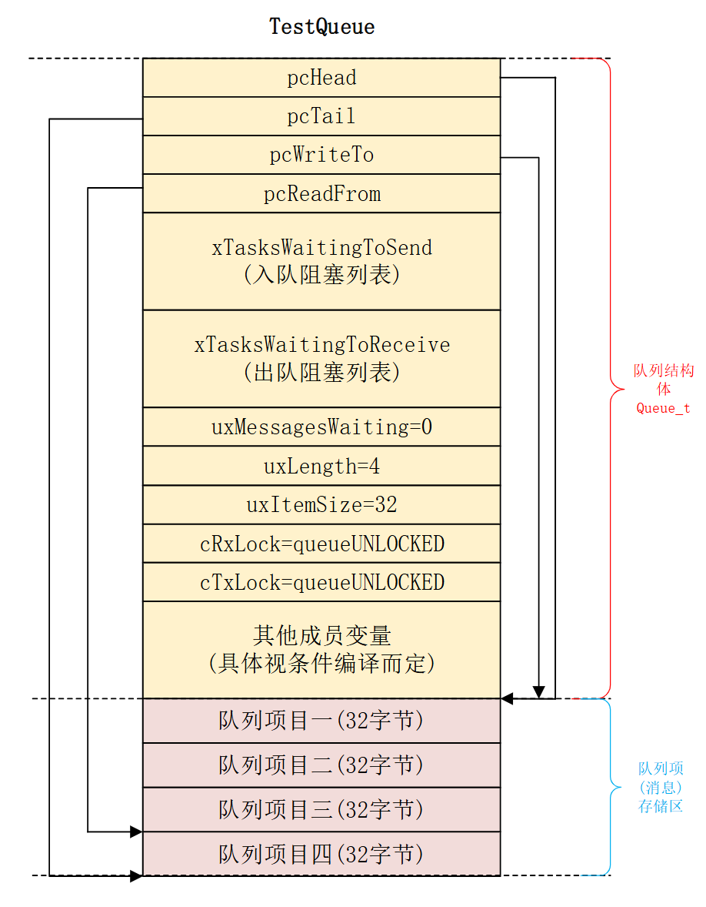
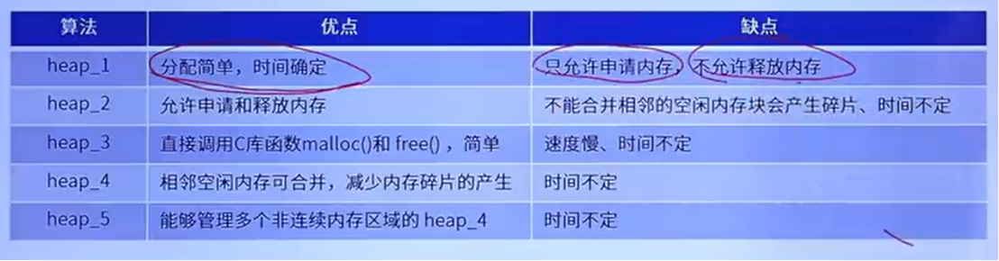

# 任务间通信

## 队列

**结构体**

```c
typedef struct QueueDefinition
{
	int8_t *pcHead;  //指向队列存储区开始地址。
	int8_t *pcTail;  //指向队列存储区最后一个字节。
	int8_t *pcWriteTo;  //指向存储区中下一个空闲区域。
	
	union
	{
		int8_t *pcReadFrom;  //当用作队列的时候指向最后一个出队的队列项首地址
		UBaseType_t uxRecursiveCallCount;//当用作递归互斥量的时候用来记录递归互斥量被
										 //调用的次数。
	} u;
	
	List_t xTasksWaitingToSend;     //等待发送任务列表，那些因为队列满导致入队失败而进
									//入阻塞态的任务就会挂到此列表上。
	
	List_t xTasksWaitingToReceive;  //等待接收任务列表，那些因为队列空导致出队失败而进
									//入阻塞态的任务就会挂到此列表上。
									
	volatile UBaseType_t uxMessagesWaiting; //队列中当前队列项数量，也就是消息数
	
	UBaseType_t uxLength;   //创建队列时指定的队列长度，也就是队列中最大允许的
							//队列项(消息)数量
	UBaseType_t uxItemSize;  //创建队列时指定的每个队列项(消息)最大长度，单位字节
	volatile int8_t cRxLock;  //当队列上锁以后用来统计从队列中接收到的队列项数
							  //量， 也就是出队的队列项数量， 当队列没有上锁的话此字
							  //段为 queueUNLOCKED
	
	volatile int8_t cTxLock;  //当队列上锁以后用来统计发送到队列中的队列项数量，
							  //也就是入队的队列项数量，当队列没有上锁的话此字
							  //段为 queueUNLOCKED
	#if( ( configSUPPORT_STATIC_ALLOCATION == 1 ) &&\
		( configSUPPORT_DYNAMIC_ALLOCATION == 1 ) )
		uint8_t ucStaticallyAllocated; //如果使用静态存储的话此字段设置为 pdTURE。
	#endif
	
	#if ( configUSE_QUEUE_SETS == 1 )
		//队列集相关宏
		struct QueueDefinition *pxQueueSetContainer;
	#endif
	
	#if ( configUSE_TRACE_FACILITY == 1 ) //跟踪调试相关宏
		UBaseType_t uxQueueNumber;
		uint8_t ucQueueType;
	#endif
} xQUEUE;

typedef xQUEUE Queue_t;
```

### 初始化API

| 函数                          | 说明                                                                                         |
| --------------------------- | ------------------------------------------------------------------------------------------ |
| xQueueCreate()              | 此函数本质上是一个宏， 用来动态创建队列， 此宏最终调用的是函数xQueueGenericCre                                           |
| xQueueCreateStatic(）        | 此函数也是用于创建队列的，但是使用的静态方法创建队列，队列所需要的内存由用户自行分配，此函数本质上也是一个宏，此宏最终调用的是函数xQueueGenericCreateStatic |
| xQueueGenericCreate()       | 用于动态创建                                                                                     |
| xQueueGenericCreateStatic() | 静态方法创建队列                                                                                   |
| prvInitialiseNewQueu        | 队列初始化函数                                                                                    |
| xQueueGenericRese           | 队列复位函数                                                                                     |


```c
QueueHandle_t xQueueGenericCreate( const UBaseType_t uxQueueLength,
									const UBaseType_t uxItemSize,
									const uint8_t ucQueueType )
```

**参数**：
- uxQueueLength： 要创建的队列的队列长度，这里是队列的项目数。
- uxItemSize：队列中每个项目(消息)的长度，单位为字节。
- ucQueueType： 队列类型，由于 FreeRTOS 中的信号量等也是通过队列来实现的，创建信号
量的函数最终也是使用此函数的， 因此在创建的时候需要指定此队列的用途，
也就是队列类型，一共有六种类型：
	- queueQUEUE_TYPE_BAS：普通的消息队列
	- queueQUEUE_TYPE_SET：队列集
	- queueQUEUE_TYPE_MUTEX：互斥信号量
	- queueQUEUE_TYPE_COUNTING_SEMAPHORE：计数型信号量
	- queueQUEUE_TYPE_BINARY_SEMAPHORE：二值信号量
	- queueQUEUE_TYPE_RECURSIVE_MUTEX：递归互斥信号量

函数 xQueueCreate() 创 建 队 列 的 时 候 此 参 数 默 认 选 择 的 就 是
queueQUEUE_TYPE_BASE。

**队列组成**


**队列复位后的情况**



### 发送信息API


| 分类      | 函数                         | 说明                                        |
| ------- | -------------------------- | ----------------------------------------- |
| 任务级入队函数 | xQueueSend()               | 发送消息到队列尾部（后向入队），这两个函数是一样的。                |
|         | xQueueSendToBack()         | 同上                                        |
|         | xQueueSendToFront()        | 发送消息到队列头（前向入队）。                           |
|         | xQueueOverwrite()          | 发送消息到队列，带覆写功能，当队列满了以后自动覆盖掉旧的消息。           |
| 中断级入队函数 | xQueueSendFromISR()        | 发送消息到队列尾（后向入队），这两个函数是一样的，用于中断服务函数         |
|         | xQueueSendToBackFromISR()  | 同上                                        |
|         | xQueueSendToFrontFromISR() | 发送消息到队列头（前向入队），用于中断服务函数                   |
|         | xQueueOverwriteFromISR()   | 发送消息到队列，带覆写功能，当队列满了以后自动覆盖掉旧的消息， 用于中断服务函数。 |

这三个函数都是用于向队列中发送消息的， 这三个函数本质都是宏， 其中函数xQueueSend()和 xQueueSendToBack()是一样的，都是后向入队，即将新的消息插入到队列的后面。函数xQueueSendToToFront()是前向入队，即将新消息插入到队列的前面。然而！这三个函数最后都是调用的同一个函数：xQueueGenericSend()。这三个函数只能用于任务函数中，不能用于中断服务函数，中断服务函数有专用的函数

```c
BaseType_t xQueueGenericSend( QueueHandle_t xQueue,
							const void * const pvItemToQueue,
							TickType_t xTicksToWait,
							const BaseType_t xCopyPosition )
```

**参数**：
- xQueue：队列句柄，指明要向哪个队列发送数据，创建队列成功以后会返回此队列的队列句柄。
- pvItemToQueue：指向要发送的消息，发送的过程中会将这个消息拷贝到队列中。
- xTicksToWait： 阻塞时间。
- xCopyPosition:入队方式，有三种入队方式：
	- queueSEND_TO_BACK：后向入队
	- queueSEND_TO_FRONT：前向入队
	- queueOVERWRITE：覆写入队。

三个中断发送函数也是向队列中发送消息的，这三个函数用于中断服务函数中。这三个函数本质
也宏，其中函数xQueueSendFromISR ()和xQueueSendToBackFromISR ()是一样的，都是后向入
队，即将新的消息插入到队列的后面。函数xQueueSendToFrontFromISR ()是前向入队，即将新
消息插入到队列的前面。这三个函数同样调用同一个函数xQueueGenericSendFromISR ()。

xQueueOverwrite()的中断级版本，用在中断服务函数中，在队列满的时候自动覆写掉旧的数据，此函数也是一个宏，实际调用的也是函数 xQueueGenericSendFromISR

```c
BaseType_t xQueueGenericSendFromISR(QueueHandle_t xQueue,
									const void* pvItemToQueue,
									BaseType_t* pxHigherPriorityTaskWoken,
									BaseType_t xCopyPosition);
```

**参数**：
- xQueue：队列句柄，指明要向哪个队列发送数据，创建队列成功以后会返回此队列的队列句柄。
- pvItemToQueue：指向要发送的消息，发送的过程中会将这个消息拷贝到队列中。
- pxHigherPriorityTaskWoken：标记退出此函数以后是否进行任务切换，这个变量的值由这三个函数来设置的，用户不用进行设置，用户只需要提供一个变量来保存这个值就行了。当此值为pdTRUE的时候在退出中断服务函数之前一定要进行一次任务切换。
- xCopyPosition:入队方式，有三种入队方式：
	- queueSEND_TO_BACK：后向入队
	- queueSEND_TO_FRONT：前向入队
	- queueOVERWRITE：覆写入队。

==具体代码自己看源码，可以看懂==

==中断级入队函数和任务级入队函数大同小异，比任务级函数更简单因为没有阻塞时间==

### 读取信息API

| 分类      | 函数                     | 说明                                         |
| ------- | ---------------------- | ------------------------------------------ |
| 任务级出队函数 | xQueueReceive()        | 从队列中读取队列项(消息)，并且读取完以后删除掉队列项(消息)            |
|         | xQueuePeek()           | 从队列中读取队列项(消息)，并且读取完以后不删除队列项(消息)            |
| 中断级出队函数 | xQueueReceiveFromISR() | 从队列中读取队列项(消息)，并且读取完以后删除掉队列项(消息)，用于中断服务函数中  |
|         | xQueuePeekFromISR ()   | 从队列中读取队列项(消息)，并且读取完以后不删除队列项(消息)，用于中断服务函数中。 |

==和发送函数相似，自己去读源码==


### 队列上锁和解锁

==自己看源码比较简单==

上锁计数器(cTxLock 和 cRxLock)记录了在队列上锁期间，入队或出队的数量

### 信号量

二值信号量、计数信号量、互斥量都是基于队列的创建、发送和读取

优先级继承是判断当前任务的任务优先级是否比正在拥有互斥信号量的那个任务的任务优先级高，如果是的话就 会把拥有互斥信号量的那个低优先级任务的优先级调整为与当前任务相同的优先级！

## 内存管理

FreeRTOS 中 的 内 存 堆 为 ucHeap\[\]

```c
static uint8_t ucHeap[ configTOTAL_HEAP_SIZE ];
```

| 策略       | 是否支持释放 | 是否合并空闲块   | 特点与适用场景                                                                                                                 |
| -------- | ------ | --------- | ----------------------------------------------------------------------------------------------------------------------- |
| `heap_1` | ❌ 不支持  | ❌ 不支持     | 最简单，适合任务固定、无需释放的系统，只能分配不能释放，==主要是靠移动指针指向当前空闲的地址==                                                                       |
| `heap_2` | ✅ 支持   | ❌ 不支持     | 支持释放但不合并，适合内存块大小固定的场景，==采用链式管理，分为已被分配链表和空闲链表、链表排序为升序排列，每次分配的内存块会指向下一个空闲内存块，所以可以做到释放，但分配后的内存块大小就固定了，不能去合并==              |
| `heap_3` | ✅ 支持   | ✅ 由 C 库决定 | 封装 `malloc/free`，适合资源充足但实时性要求不高，==注意，在 heap_3 中 configTOTAL_HEAP_SIZE 是没用的！因为调用的是标准库的malloc和free函数，需要在启动文件修改heap_size== |
| `heap_4` | ✅ 支持   | ✅ 支持      | 默认推荐，灵活性高，适合大多数嵌入式项目，==和heap2一样都是采用链式管理，但多了内存合并功能，使用的管理结构体是一样的，也就是插入空闲链表时判断是否可以合并==                                     |
| `heap_5` | ✅ 支持   | ✅ 支持      | 支持多内存区域，适合有外部 RAM 的复杂系统，==heap_5 使用了和 heap_4 相同的合并算法==                                                                  |




具体细节和结构体变量自己去查看文档和代码，比较简单

